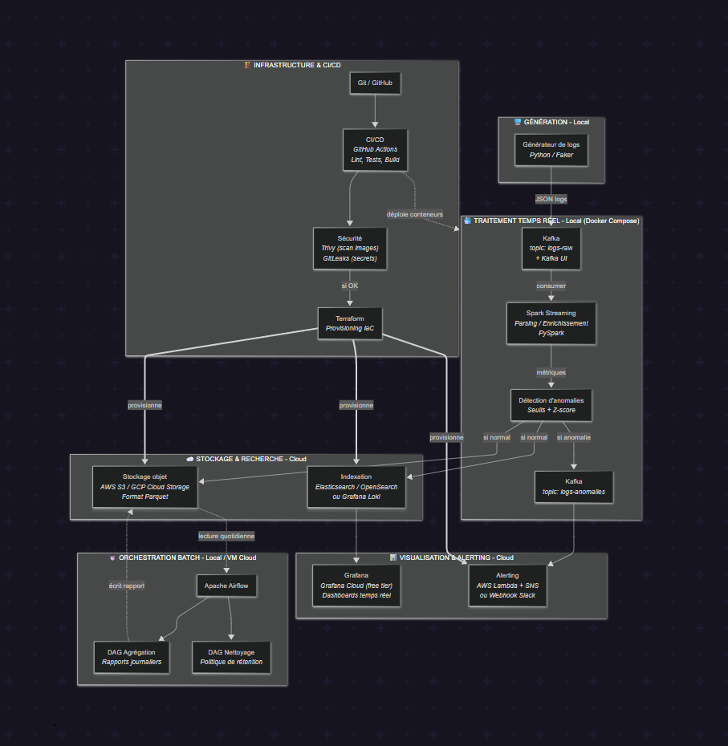

# 📊 Plateforme d'Analyse de Logs à Grande Échelle

Pipeline complet de collecte, traitement en temps réel, détection d'anomalies, archivage cloud et visualisation de logs applicatifs, avec orchestration batch, infrastructure as code et CI/CD.

> Projet personnel DevOps / Cloud / Big Data — développé sur Fedora Linux (16 Go RAM, i7 11e gen, 512 Go SSD)

---

## 📐 Architecture

<!--
  Pour insérer ton image de schéma d'architecture :
  1. Exporte ton diagramme (depuis mermaid.live : bouton "Export" > PNG ou SVG)
  2. Place le fichier exporté dans un dossier `docs/` à la racine du projet, par exemple `docs/architecture.png`
  3. Remplace la ligne ci-dessous par : 
-->


Le pipeline suit le flux suivant :

```
Génération de logs → Kafka → Spark Streaming → Détection d'anomalies
                                    ↓                      ↓
                          Stockage S3 (Parquet)    Topic Kafka anomalies
                                    ↓                      ↓
                          Loki → Grafana            Alerting Slack

Orchestration batch (Airflow) : agrégation quotidienne + nettoyage/rétention
Infrastructure (Terraform) + CI/CD (GitHub Actions)
```

Un schéma Mermaid détaillé et éditable est disponible dans [`docs/architecture.mermaid`](docs/architecture.mermaid) — modifiable directement sur [mermaid.live](https://mermaid.live).

---

## 🧰 Stack technique

| Domaine | Outil |
|---|---|
| Ingestion de messages | Apache Kafka (mode KRaft) |
| Interface Kafka | Kafka UI |
| Traitement temps réel | Apache Spark Streaming (PySpark 4.2.0) |
| Stockage objet | AWS S3 (format Parquet) |
| Indexation / recherche de logs | Grafana Loki |
| Visualisation | Grafana (3 dashboards) |
| Alerting | Slack (webhook entrant + cooldown anti-spam) |
| Orchestration batch | Apache Airflow (LocalExecutor) |
| Infrastructure as Code | Terraform (provider AWS) |
| CI/CD | GitHub Actions |
| Conteneurisation | Docker & Docker Compose |
| Langage principal | Python 3.11+ |

---

## 📁 Structure du projet

```
projet-log-analytics/
├── docker-compose.yml          # Kafka, Kafka UI, Loki, Grafana
├── generator/                  # Générateur de logs applicatifs simulés
│   └── generator.py
├── processing/                 # Traitement Spark Streaming
│   └── process_logs.py
├── loki-forwarder/              # Pont Kafka → Loki
│   └── forwarder.py
├── alerting/                   # Consumer d'alertes Slack
│   └── alert_consumer.py
├── airflow/                     # Orchestration batch
│   ├── docker-compose.yaml
│   ├── Dockerfile
│   └── dags/
│       ├── dag_agregation.py
│       └── dag_nettoyage.py
├── terraform/                   # Infrastructure as Code
│   ├── main.tf
│   └── variables.tf
├── .github/workflows/
│   └── ci.yml                   # Pipeline CI/CD
├── docs/
│   ├── architecture.png         # Image du schéma d'architecture
│   └── architecture.mermaid     # Source éditable du schéma
└── README.md
```

---

## ✅ Prérequis

- Linux (testé sur Fedora) avec Docker et Docker Compose
- Python 3.11+
- Java 17 (recommandé via [SDKMAN](https://sdkman.io/), en coexistence avec une version système plus récente si besoin)
- Un compte AWS avec un utilisateur IAM disposant d'un accès S3 limité (principe du moindre privilège)
- Un compte Slack avec un webhook entrant configuré
- Terraform CLI

---

## 🚀 Installation et lancement

### 1. Cloner le dépôt

```bash
git clone https://github.com/Eachr4f/projet-log-analytics.git
cd projet-log-analytics
```

### 2. Lancer l'infrastructure locale (Kafka, Kafka UI, Loki, Grafana)

```bash
docker compose up -d
```

Créer les topics Kafka nécessaires :
```bash
docker exec -it kafka /opt/kafka/bin/kafka-topics.sh --create \
  --topic logs-raw --bootstrap-server localhost:9092 --partitions 3 --replication-factor 1

docker exec -it kafka /opt/kafka/bin/kafka-topics.sh --create \
  --topic logs-anomalies --bootstrap-server localhost:9092 --partitions 3 --replication-factor 1
```

### 3. Configurer les accès AWS

```bash
aws configure
```

### 4. Provisionner l'infrastructure cloud avec Terraform

```bash
cd terraform
terraform init
terraform apply
cd ..
```

### 5. Lancer le générateur de logs

```bash
cd generator
python3 -m venv venv
source venv/bin/activate
pip install confluent-kafka faker
python3 generator.py
```

### 6. Lancer le traitement Spark

```bash
cd processing
python3 -m venv venv
source venv/bin/activate
pip install pyspark

export AWS_ACCESS_KEY_ID=$(aws configure get aws_access_key_id)
export AWS_SECRET_ACCESS_KEY=$(aws configure get aws_secret_access_key)

spark-submit \
  --packages org.apache.spark:spark-sql-kafka-0-10_2.13:4.2.0,org.apache.hadoop:hadoop-aws:3.5.0 \
  process_logs.py
```

### 7. Lancer le forwarder vers Loki

```bash
cd loki-forwarder
python3 -m venv venv
source venv/bin/activate
pip install confluent-kafka requests
python3 forwarder.py
```

### 8. Lancer le consumer d'alertes Slack

```bash
cd alerting
python3 -m venv venv
source venv/bin/activate
pip install confluent-kafka requests

export SLACK_WEBHOOK_URL="https://hooks.slack.com/services/TON/WEBHOOK/URL"
python3 alert_consumer.py
```

### 9. Lancer Airflow

```bash
cd airflow
docker compose up airflow-init
docker compose up -d
```

### 10. Accéder aux interfaces

| Service | URL | Identifiants |
|---|---|---|
| Kafka UI | http://localhost:8080 | — |
| Grafana | http://localhost:3000 | admin / admin |
| Airflow | http://localhost:8081 | airflow / airflow |

---

## 🔍 Fonctionnalités

- **Traitement temps réel** : calcul de métriques (volume, latence moyenne, taux d'erreur) par service sur des fenêtres glissantes de 1 minute
- **Détection d'anomalies** : déclenchement automatique si le taux d'erreur dépasse 30 % sur une fenêtre
- **Archivage cloud** : écriture continue des logs traités vers S3 au format Parquet, partitionné par date
- **Observabilité** : 3 dashboards Grafana (vue d'ensemble, anomalies en direct, latence P95 par service)
- **Alerting intelligent** : notification Slack automatique avec cooldown de 5 minutes par service pour éviter le spam d'alertes
- **Orchestration batch** :
  - DAG d'agrégation quotidienne (statistiques journalières par service, écrites dans S3)
  - DAG de nettoyage appliquant la politique de rétention des données archivées
- **Infrastructure reproductible** : bucket S3 et règles de sécurité (blocage d'accès public) gérés par Terraform
- **CI/CD** : validation automatique du code (lint), de l'infrastructure (`terraform validate`) et scan de secrets à chaque push

---

## 🔐 Sécurité

- Aucun secret (clé AWS, webhook Slack) n'est stocké en dur dans le code — tout passe par des variables d'environnement
- Utilisateur IAM dédié avec permissions limitées à S3 (principe du moindre privilège)
- Accès public bloqué sur le bucket S3 (`aws_s3_bucket_public_access_block`)
- Scan automatique de secrets dans le pipeline CI/CD

---

## 🗺️ Roadmap — Phase 2 (professionnalisation)

Une deuxième phase d'évolution est en cours de conception pour rapprocher le projet d'une architecture de production :

| Axe | Description |
|---|---|
| **Source de logs réelle** | Remplacement du générateur simulé par une collecte de vrais logs Nginx via Fluent Bit |
| **Kubernetes** | Migration de Kafka (via l'opérateur Strimzi) et de Loki/Grafana (via Helm) vers un cluster Kubernetes local (Kind) |
| **CI/CD Jenkins** | Ajout d'un second pipeline CI/CD capable de déployer automatiquement sur le cluster Kubernetes |
| **Détection d'anomalies par Machine Learning** | Remplacement de la règle de seuil fixe par un modèle Isolation Forest (scikit-learn), réentraîné périodiquement via un DAG Airflow dédié |

> Spark Streaming et Airflow resteront volontairement hors du cluster Kubernetes dans cette phase, pour limiter la consommation mémoire sur un environnement de développement à 16 Go de RAM — un arbitrage documenté plutôt qu'une limitation subie.

Détail complet dans [`docs/cahier-des-charges-phase2.md`](docs/cahier-des-charges-phase2.md).

---

## 🧠 Compétences démontrées

- Ingestion et traitement de flux de données à grande échelle (Kafka, Spark Streaming)
- Détection d'anomalies et calcul de métriques sur fenêtres glissantes
- Intégration cloud hybride (traitement local, stockage et alerting managés)
- Observabilité applicative (Grafana, Loki, alerting avec anti-spam)
- Orchestration de workflows batch (Airflow, DAGs avec dépendances et retries)
- Infrastructure as Code (Terraform, gestion d'état, import de ressources existantes)
- CI/CD et bonnes pratiques DevSecOps (lint, validation infra, scan de secrets)
- Résolution de problèmes réels de compatibilité de versions (Java/Spark/Hadoop) et de sécurité (nettoyage d'historique Git après exposition d'un secret)

---

## 📄 Projet personnel à but éducatif et de démonstration.

## 👤 Auteur

**Eahcr4f** — Projet DevOps / Cloud / Big Data
